# 🔄 Guía de Migraciones con Alembic - Triskel API

¡Hola!
Si has llegado aquí estas interesado en migrar la base de datos SQL de Trikel (Recuerda que esta solo contiene información de usaurios y logs de sus acciones).
Aquí tienes una guía completa para crear, aplicar y gestionar migraciones de base de datos en el proyecto Triskel hecho por Mandrágora.
Esperamos que disfrutes leyendo nuestro código ;)
---

## 📚 Tabla de Contenidos

- [Configuración Inicial](#configuración-inicial)
- [Crear una Migración](#crear-una-migración)
- [Aplicar Migraciones](#aplicar-migraciones)
- [Comandos Útiles](#comandos-útiles)
- [Mejores Prácticas](#mejores-prácticas)
- [Ejemplos Prácticos](#ejemplos-prácticos)
- [Solución de Problemas](#solución-de-problemas)

---


## ⚙️ Configuración Inicial

### Prerequisitos

```bash
# Verificar que tienes Alembic instalado
alembic --version
# Salida esperada: alembic 1.x.x
```

### Variables de Entorno

Asegúrate de tener tu `.env` configurado:

```env
# PostgreSQL (Base de datos SQL)
DB_HOST=localhost
DB_PORT=5432
DB_NAME=triskel_db
DB_USER=postgres
DB_PASSWORD=tu_password_aqui

# Firebase (Base de datos NoSQL - datos del juego)
FIREBASE_CREDENTIALS_BASE64=tu_credencial_base64
```

### Estructura del Proyecto

```
Triskel-API/
├── alembic/                          # Configuración de Alembic
│   ├── versions/                     # 📁 Migraciones van aquí
│   │   └── 20250123_0001_initial_auth_tables.py
│   ├── env.py                        # Configuración del entorno
│   └── script.py.mako                # Template para nuevas migraciones
├── alembic.ini                       # Configuración principal
└── app/
    └── domain/
        └── auth/
            └── models.py             # 📝 Modelos SQLAlchemy
```

---

## 🚀 Crear una Migración

### Paso 1: Modificar el Modelo

Edita `app/domain/auth/models.py` para hacer tus cambios:

**Ejemplo: Añadir campo "phone" a AdminUser**

```python
# app/domain/auth/models.py

from sqlalchemy import Boolean, Column, DateTime, Integer, String
from sqlalchemy.sql import func
from app.infrastructure.database.sql_client import Base

class AdminUser(Base):
    """Usuario administrador del sistema."""

    __tablename__ = "admin_users"

    # Campos existentes
    id = Column(Integer, primary_key=True, autoincrement=True)
    username = Column(String(50), unique=True, nullable=False, index=True)
    email = Column(String(100), unique=True, nullable=False, index=True)
    password_hash = Column(String(255), nullable=False)
    role = Column(String(20), nullable=False, default="viewer", index=True)
    is_active = Column(Boolean, default=True, nullable=False)

    # ⭐ NUEVO: Campo teléfono
    phone = Column(String(20), nullable=True)  # 👈 Añades esto

    # Timestamps
    created_at = Column(DateTime(timezone=True), server_default=func.now())
    updated_at = Column(DateTime(timezone=True), server_default=func.now(), onupdate=func.now())
    last_login = Column(DateTime(timezone=True), nullable=True)
```

### Paso 2: Generar la Migración

```bash
# Opción 1: Autogenerar (Recomendado)
alembic revision --autogenerate -m "add phone field to admin_users"

# Opción 2: Migración vacía (manual)
alembic revision -m "add phone field to admin_users"
```

**Salida esperada:**

```
INFO  [alembic.runtime.migration] Context impl PostgresqlImpl.
INFO  [alembic.autogenerate.compare] Detected added column 'admin_users.phone'
  Generating /path/to/alembic/versions/20260131_1430_002_add_phone_field_to_admin_users.py ... done
```

### Paso 3: Revisar la Migración Generada

**Archivo:** `alembic/versions/20260131_1430_002_add_phone_field_to_admin_users.py`

```python
"""add phone field to admin_users

Revision ID: def456abc789
Revises: abc123def456
Create Date: 2026-01-31 14:30:45.123456
"""
from alembic import op
import sqlalchemy as sa

# revision identifiers, used by Alembic.
revision = 'def456abc789'
down_revision = 'abc123def456'  # La migración anterior
branch_labels = None
depends_on = None

def upgrade():
    """Aplica los cambios a la base de datos."""
    # ### commands auto generated by Alembic - please adjust! ###
    op.add_column('admin_users', sa.Column('phone', sa.String(length=20), nullable=True))
    # ### end Alembic commands ###

def downgrade():
    """Revierte los cambios (rollback)."""
    # ### commands auto generated by Alembic - please adjust! ###
    op.drop_column('admin_users', 'phone')
    # ### end Alembic commands ###
```

**⚠️ IMPORTANTE:** Siempre revisa el código generado. Alembic es inteligente pero no perfecto.

### Paso 4: Probar Localmente

```bash
# Ver el estado actual
alembic current

# Aplicar la migración
alembic upgrade head

# Verificar en la base de datos
psql -d triskel_db -c "\d admin_users"
# Deberías ver la columna 'phone'
```

Si algo falla:

```bash
# Revertir la migración
alembic downgrade -1

# Arreglar el código de la migración
# Volver a intentar
alembic upgrade head
```

### Paso 5: Commit y Push

```bash
git add alembic/versions/20260131_1430_002_add_phone_field_to_admin_users.py
git add app/domain/auth/models.py
git commit -m "feat: add phone field to admin_users table"
git push origin main
```

### Paso 6: Aplicar en Producción

**Opción A: Desde el Dashboard Web (Recomendado)**

1. Ir a `https://tu-dominio.com/web/admin/migrations`
2. Login con credenciales de admin
3. Ver "1 migración pendiente"
4. Click en **"Descargar SQL"** → Revisar cambios
5. Click en **"Aplicar Migraciones"** → Confirmar
6. Verificar en el log: ✓ "Migración completada"

**Opción B: SSH en el Servidor**

```bash
ssh tu-servidor
cd /path/to/Triskel-API
alembic upgrade head
```

---

## 📖 Comandos Útiles

### Ver Estado

```bash
# Ver revisión actual de la BD
alembic current

# Ver historial completo
alembic history

# Ver historial detallado
alembic history --verbose

# Ver migraciones pendientes
alembic heads
```

### Aplicar Migraciones

```bash
# Aplicar todas las pendientes
alembic upgrade head

# Aplicar solo la siguiente
alembic upgrade +1

# Aplicar hasta una revisión específica
alembic upgrade def456abc789

# Ver SQL sin ejecutar (útil para revisar)
alembic upgrade head --sql

# Guardar SQL en archivo
alembic upgrade head --sql > migration.sql
```

### Revertir Migraciones

```bash
# Revertir la última migración
alembic downgrade -1

# Revertir hasta revisión específica
alembic downgrade abc123def456

# Revertir TODAS (volver a BD vacía)
alembic downgrade base

# Ver SQL del downgrade sin ejecutar
alembic downgrade -1 --sql
```

### Stamps (Marcar revisión sin ejecutar)

```bash
# Marcar BD como si estuviera en la última revisión
# Útil cuando creaste las tablas manualmente
alembic stamp head

# Marcar una revisión específica
alembic stamp def456abc789
```

---

## ✨ Mejores Prácticas

### 1. Nombres Descriptivos

❌ **Mal:**
```bash
alembic revision -m "update"
alembic revision -m "fix"
alembic revision -m "changes"
```

✅ **Bien:**
```bash
alembic revision -m "add email_verified field to admin_users"
alembic revision -m "create index on audit_logs timestamp"
alembic revision -m "add unique constraint to username"
```

### 2. Siempre Usar --autogenerate

```bash
# ✅ Recomendado: Alembic detecta cambios automáticamente
alembic revision --autogenerate -m "add phone field"

# ⚠️ Solo si sabes lo que haces (migración manual)
alembic revision -m "custom migration"
```

### 3. Revisar SIEMPRE el Código Generado

```python
# ❌ NO hagas esto:
alembic revision --autogenerate -m "cambios"
git add .
git commit -m "migration"
git push

# ✅ HAZLO así:
alembic revision --autogenerate -m "add phone field"
# 👀 REVISAR el archivo .py generado
# ✅ Probar localmente
alembic upgrade head
# ✅ Verificar que funcione
git add ...
git commit ...
git push
```

### 4. Probar Upgrade Y Downgrade

```bash
# Aplicar
alembic upgrade head

# Verificar que funcione
# ...

# Revertir
alembic downgrade -1

# Verificar que el rollback funcione
# ...

# Volver a aplicar
alembic upgrade head
```

### 5. No Modificar Migraciones Ya Aplicadas

❌ **NUNCA hagas esto:**
```python
# Editar una migración que ya se aplicó en producción
# alembic/versions/20250123_001_initial.py
def upgrade():
    op.create_table('admin_users', ...)
    op.add_column('admin_users', ...)  # ❌ Añadiendo más cosas después
```

✅ **Haz esto:**
```bash
# Crear una NUEVA migración
alembic revision --autogenerate -m "add missing column"
```

### 6. Backup Antes de Aplicar en Producción

```bash
# Antes de aplicar migraciones en producción
pg_dump -h localhost -U postgres triskel_db > backup_$(date +%Y%m%d_%H%M%S).sql

# Aplicar migración
alembic upgrade head

# Si algo falla, restaurar
psql -h localhost -U postgres triskel_db < backup_20260131_143022.sql
```

### 7. Migraciones Reversibles

Asegúrate de que `downgrade()` funcione:

```python
def upgrade():
    op.add_column('admin_users', sa.Column('phone', sa.String(20), nullable=True))

def downgrade():
    op.drop_column('admin_users', 'phone')  # ✅ Debe revertir upgrade()
```

---

## 🔧 Ejemplos Prácticos

### Ejemplo 1: Añadir una Columna

**Objetivo:** Añadir campo `phone_verified` a `AdminUser`

```python
# 1. Editar models.py
class AdminUser(Base):
    # ... campos existentes ...
    phone_verified = Column(Boolean, default=False, nullable=False)
```

```bash
# 2. Generar migración
alembic revision --autogenerate -m "add phone_verified to admin_users"

# 3. Revisar el archivo generado
# alembic/versions/xxx_add_phone_verified_to_admin_users.py

# 4. Aplicar
alembic upgrade head
```

### Ejemplo 2: Crear un Índice

**Objetivo:** Índice en `audit_logs.timestamp` para queries más rápidas

```python
# 1. Editar models.py
class AuditLog(Base):
    # ... campos existentes ...
    timestamp = Column(DateTime(timezone=True), server_default=func.now(),
                      nullable=False, index=True)  # 👈 Añadir index=True
```

```bash
# 2. Generar migración
alembic revision --autogenerate -m "add index on audit_logs timestamp"

# 3. El código generado será:
def upgrade():
    op.create_index(op.f('ix_audit_logs_timestamp'), 'audit_logs', ['timestamp'])

def downgrade():
    op.drop_index(op.f('ix_audit_logs_timestamp'), table_name='audit_logs')

# 4. Aplicar
alembic upgrade head
```

### Ejemplo 3: Añadir Constraint Único

**Objetivo:** Asegurar que `username` sea único (si no lo era)

```python
# 1. Editar models.py
class AdminUser(Base):
    username = Column(String(50), unique=True, nullable=False, index=True)  # 👈 unique=True
```

```bash
# 2. Generar migración
alembic revision --autogenerate -m "add unique constraint to username"

# 3. Código generado:
def upgrade():
    op.create_unique_constraint('uq_admin_users_username', 'admin_users', ['username'])

def downgrade():
    op.drop_constraint('uq_admin_users_username', 'admin_users', type_='unique')

# 4. Aplicar
alembic upgrade head
```

### Ejemplo 4: Cambiar Tipo de Columna

**Objetivo:** Cambiar `phone` de `String(20)` a `String(50)`

```python
# 1. Editar models.py
class AdminUser(Base):
    phone = Column(String(50), nullable=True)  # Era String(20)
```

```bash
# 2. Generar migración
alembic revision --autogenerate -m "increase phone field length to 50"

# 3. Código generado:
def upgrade():
    op.alter_column('admin_users', 'phone',
                   existing_type=sa.VARCHAR(length=20),
                   type_=sa.String(length=50),
                   existing_nullable=True)

def downgrade():
    op.alter_column('admin_users', 'phone',
                   existing_type=sa.VARCHAR(length=50),
                   type_=sa.String(length=20),
                   existing_nullable=True)

# 4. Aplicar
alembic upgrade head
```

### Ejemplo 5: Migración de Datos

**Objetivo:** Migrar datos existentes durante el cambio de esquema

```python
"""set default role for existing users

Revision ID: xyz789
"""
from alembic import op
import sqlalchemy as sa

def upgrade():
    # 1. Añadir columna
    op.add_column('admin_users', sa.Column('role', sa.String(20), nullable=True))

    # 2. Migrar datos (todos los usuarios existentes → rol 'viewer')
    op.execute("UPDATE admin_users SET role = 'viewer' WHERE role IS NULL")

    # 3. Hacer la columna NOT NULL
    op.alter_column('admin_users', 'role', nullable=False)

def downgrade():
    op.drop_column('admin_users', 'role')
```

### Ejemplo 6: Crear Tabla Nueva

**Objetivo:** Añadir tabla `refresh_tokens` para JWT

```python
# 1. Crear nuevo modelo en models.py
class RefreshToken(Base):
    __tablename__ = "refresh_tokens"

    id = Column(Integer, primary_key=True)
    user_id = Column(Integer, ForeignKey("admin_users.id", ondelete="CASCADE"))
    token = Column(String(500), unique=True, nullable=False)
    expires_at = Column(DateTime(timezone=True), nullable=False)
    created_at = Column(DateTime(timezone=True), server_default=func.now())
```

```bash
# 2. Generar migración
alembic revision --autogenerate -m "create refresh_tokens table"

# 3. Código generado:
def upgrade():
    op.create_table('refresh_tokens',
        sa.Column('id', sa.Integer(), nullable=False),
        sa.Column('user_id', sa.Integer(), nullable=True),
        sa.Column('token', sa.String(length=500), nullable=False),
        sa.Column('expires_at', sa.DateTime(timezone=True), nullable=False),
        sa.Column('created_at', sa.DateTime(timezone=True),
                 server_default=sa.text('now()'), nullable=True),
        sa.ForeignKeyConstraint(['user_id'], ['admin_users.id'], ondelete='CASCADE'),
        sa.PrimaryKeyConstraint('id'),
        sa.UniqueConstraint('token')
    )

def downgrade():
    op.drop_table('refresh_tokens')

# 4. Aplicar
alembic upgrade head
```

---

## 🔍 Solución de Problemas

### Problema 1: "Target database is not up to date"

**Error:**
```
FAILED: Target database is not up to date.
```

**Causa:** La BD tiene una revisión diferente a la esperada.

**Solución:**
```bash
# Ver revisión actual
alembic current

# Ver historial
alembic history

# Aplicar migraciones faltantes
alembic upgrade head
```

### Problema 2: "Can't locate revision identified by 'head'"

**Error:**
```
Can't locate revision identified by 'head'
```

**Causa:** No hay migraciones en `alembic/versions/`

**Solución:**
```bash
# Crear la primera migración
alembic revision --autogenerate -m "initial migration"
```

### Problema 3: "Multiple head revisions are present"

**Error:**
```
Multiple head revisions are present; please specify which head to resolve to
```

**Causa:** Dos ramas de migraciones (típico en merges de git)

**Solución:**
```bash
# Ver las cabezas
alembic heads

# Crear migración de merge
alembic merge -m "merge migration branches" head1 head2
```

### Problema 4: Migración no detecta cambios

**Problema:** Hiciste cambios en modelos pero `--autogenerate` no los detecta.

**Soluciones:**

1. **Verificar imports en `env.py`:**
```python
# alembic/env.py
from app.domain.auth.models import Base  # ✅ Debe importar Base
target_metadata = Base.metadata
```

2. **Limpiar cache de Python:**
```bash
find . -type d -name "__pycache__" -exec rm -r {} +
```

3. **Crear migración manual:**
```bash
alembic revision -m "manual migration"
# Editar el archivo manualmente
```

### Problema 5: Error al aplicar migración

**Error:**
```
sqlalchemy.exc.ProgrammingError: column "phone" of relation "admin_users" already exists
```

**Causa:** La columna ya existe en la BD (quizás la creaste manualmente)

**Solución:**
```bash
# Opción 1: Marcar migración como aplicada sin ejecutarla
alembic stamp head

# Opción 2: Revertir y limpiar
psql -d triskel_db -c "ALTER TABLE admin_users DROP COLUMN phone;"
alembic upgrade head
```

### Problema 6: Downgrade falla

**Error:**
```
Cannot drop column: column is used in foreign key constraint
```

**Solución:** El `downgrade()` debe eliminar las constraints primero:

```python
def downgrade():
    # 1. Eliminar constraint primero
    op.drop_constraint('fk_user_id', 'refresh_tokens', type_='foreignkey')

    # 2. Luego eliminar columna
    op.drop_column('admin_users', 'id')
```

---

## 📊 Flujo de Trabajo Completo

### Desarrollo Local


### Producción

```mermaid
graph LR
    A[Git pull] --> B[Dashboard: Ver pendientes]
    B --> C[Click: Descargar SQL]
    C --> D[Revisar SQL]
    D --> E{¿OK?}
    E -->|No| F[Corregir en dev]
    E -->|Sí| G[Click: Aplicar Migraciones]
    G --> H[Verificar logs]
    H --> I{¿Éxito?}
    I -->|No| J[Click: Revertir]
    I -->|Sí| K[✓ Completado]
```



---

## 📝 Checklist: Crear una Migración

Usa esto antes de cada migración:

- [ ] Modificar `models.py` con los cambios necesarios
- [ ] Ejecutar `alembic revision --autogenerate -m "descripción clara"`
- [ ] Revisar el archivo `.py` generado en `alembic/versions/`
- [ ] Verificar que `upgrade()` hace lo correcto
- [ ] Verificar que `downgrade()` revierte correctamente
- [ ] Probar localmente: `alembic upgrade head`
- [ ] Verificar cambios en la BD: `psql` o pgAdmin
- [ ] Probar rollback: `alembic downgrade -1`
- [ ] Volver a aplicar: `alembic upgrade head`
- [ ] Hacer commit: `git add` + `git commit` + `git push`
- [ ] En producción: Dashboard → Descargar SQL → Revisar
- [ ] En producción: Dashboard → Aplicar Migraciones
- [ ] Verificar logs de éxito

---

## 🎓 Recursos Adicionales

- [Documentación oficial de Alembic](https://alembic.sqlalchemy.org/)
- [SQLAlchemy ORM Tutorial](https://docs.sqlalchemy.org/en/20/orm/tutorial.html)
- [PostgreSQL Documentation](https://www.postgresql.org/docs/)
- [Triskel API - CLAUDE.md](./CLAUDE.md) - Arquitectura del proyecto

---

## 📧 Soporte

Si tienes dudas o problemas:

1. Revisar esta guía
2. Verificar logs en `/web/admin/migrations`
3. Consultar tabla `audit_logs` para historial
4. Revisar issues en el repositorio

---

**¡Que vayan bien esas migraciones! 🚀**
