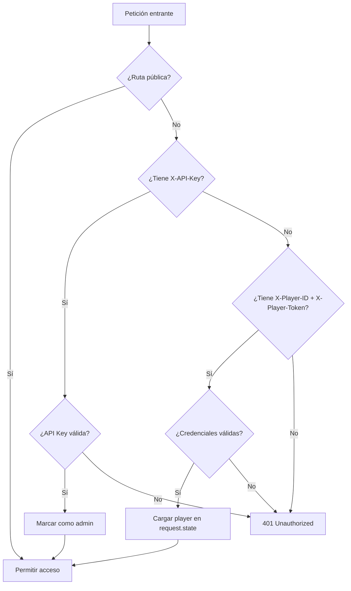

# Colección Players - Documentación Técnica

## 📋 Índice

1. [Visión General](#visión-general)
2. [Modelo de Datos](#modelo-de-datos)
3. [Autenticación y Seguridad](#autenticación-y-seguridad)
4. [Endpoints de la API](#endpoints-de-la-api)
5. [Lógica de Negocio](#lógica-de-negocio)
6. [Integración con Unity](#integración-con-unity)
7. [Ejemplos de Uso](#ejemplos-de-uso)

---

## Visión General

La colección **Players** gestiona los perfiles de los jugadores de Triskel. Cada jugador tiene:

- **Identificación única**: `player_id` (UUID) y `player_token` (token secreto)
- **Perfil**: username, email
- **Estadísticas globales**: partidas jugadas, tiempo total, alineación moral
- **Datos calculados**: mejor speedrun, reliquia favorita, decisiones morales

### Arquitectura

```
┌─────────────────┐
│   Unity/Game    │ ← Cliente (envia headers X-Player-ID + X-Player-Token)
└────────┬────────┘
         │ HTTP/REST
         ↓
┌─────────────────┐
│   API Layer     │ ← api.py (FastAPI endpoints)
│   (api.py)      │
└────────┬────────┘
         │
         ↓
┌─────────────────┐
│ Service Layer   │ ← service.py (lógica de negocio)
│  (service.py)   │
└────────┬────────┘
         │
         ↓
┌─────────────────┐
│ Repository      │ ← firestore_repository.py (acceso a BD)
│ (repository.py) │
└────────┬────────┘
         │
         ↓
┌─────────────────┐
│   Firestore     │ ← Base de datos NoSQL
└─────────────────┘
```

---

## Modelo de Datos

### `Player` (Entidad Principal)

```python
{
  "player_id": "uuid",                    # UUID único (PK)
  "username": "string",                   # 3-20 caracteres
  "email": "string | null",               # Email opcional
  "player_token": "uuid",                 # Token secreto (autenticación)

  # Timestamps
  "created_at": "2026-01-10T14:18:58Z",  # Fecha de registro
  "last_login": "2026-01-10T14:18:58Z",  # Último acceso

  # Estadísticas acumuladas
  "total_playtime_seconds": 0,            # Tiempo total jugado (>= 0)
  "games_played": 0,                      # Partidas jugadas (>= 0)
  "games_completed": 0,                   # Partidas completadas (>= 0, <= games_played)

  # Estadísticas detalladas
  "stats": {
    "total_good_choices": 0,              # Decisiones morales buenas (>= 0)
    "total_bad_choices": 0,               # Decisiones morales malas (>= 0)
    "total_deaths": 0,                    # Muertes totales (>= 0)
    "favorite_relic": "lirio | hacha | manto | null",
    "best_speedrun_seconds": null,        # Mejor tiempo (>= 0 o null)
    "moral_alignment": 0.0                # -1.0 (malo) a +1.0 (bueno)
  }
}
```

### Validaciones del Modelo

| Campo | Validación | Descripción |
|-------|------------|-------------|
| `total_playtime_seconds` | `>= 0` | No puede ser negativo |
| `games_played` | `>= 0` | No puede ser negativo |
| `games_completed` | `>= 0 && <= games_played` | No puede superar las jugadas |
| `stats.moral_alignment` | `-1.0 <= x <= 1.0` | Rango cerrado |
| `stats.favorite_relic` | `lirio \| hacha \| manto \| null` | Solo valores válidos |
| `stats.best_speedrun_seconds` | `>= 0 o null` | Positivo o nulo |

---

## Autenticación y Seguridad

### Tipos de Autenticación

#### 1️⃣ **Player Token** (Jugadores)

**Headers requeridos:**
```http
X-Player-ID: abc-123-uuid
X-Player-Token: xyz-secret-token
```

**Permisos:**
- ✅ Ver su propio perfil (`GET /v1/players/me`)
- ✅ Ver su perfil por ID (`GET /v1/players/{su_id}`)
- ✅ Actualizar su perfil (`PATCH /v1/players/{su_id}`)
- ✅ Eliminar su cuenta (`DELETE /v1/players/{su_id}`)
- ❌ Ver perfiles de otros jugadores
- ❌ Listar todos los jugadores

#### 2️⃣ **API Key** (Administradores)

**Header requerido:**
```http
X-API-Key: triskel_admin_api_key_desarrollo_2024
```

**Permisos:**
- ✅ Acceso completo a todos los endpoints
- ✅ Listar todos los jugadores
- ✅ Ver cualquier perfil
- ✅ Actualizar/eliminar cualquier jugador

### Middleware de Autenticación

Ubicación: `app/middleware/auth.py`

**Flujo de autenticación:**



**Rutas públicas (sin autenticación):**
- `GET /` - Raíz
- `GET /health` - Health check
- `GET /docs` - Documentación Swagger
- `POST /v1/players` - Crear jugador

---

## Endpoints de la API

### Base URL
```
http://localhost:8000/v1/players
```

---

### 1. Crear Jugador

**Endpoint:** `POST /v1/players`
**Autenticación:** ❌ Pública (sin headers)
**Descripción:** Registra un nuevo jugador en el sistema.

**Request Body:**
```json
{
  "username": "player123",
  "email": "player@triskel.com"  // opcional
}
```

**Response (201 Created):**
```json
{
  "player_id": "abc-123-uuid",
  "username": "player123",
  "player_token": "xyz-secret-token"
}
```

**Reglas de negocio:**
- ✅ El `username` debe ser único
- ✅ Se generan automáticamente `player_id` y `player_token`
- ✅ El cliente DEBE guardar el `player_token` localmente

**Errores:**
- `400 Bad Request` - Username ya existe

---

### 2. Ver Mi Perfil

**Endpoint:** `GET /v1/players/me`
**Autenticación:** 🔒 Requerida (Player Token o API Key)
**Descripción:** Obtiene el perfil del jugador autenticado.

**Headers:**
```http
X-Player-ID: abc-123-uuid
X-Player-Token: xyz-secret-token
```

**Response (200 OK):**
```json
{
  "player_id": "abc-123-uuid",
  "username": "player123",
  "email": "player@triskel.com",
  "player_token": "xyz-secret-token",
  "created_at": "2026-01-10T14:18:58Z",
  "last_login": "2026-01-10T14:18:58Z",
  "total_playtime_seconds": 0,
  "games_played": 0,
  "games_completed": 0,
  "stats": {
    "total_good_choices": 0,
    "total_bad_choices": 0,
    "total_deaths": 0,
    "favorite_relic": null,
    "best_speedrun_seconds": null,
    "moral_alignment": 0.0
  }
}
```

**Optimización:**
- ⚡ No hace consulta a la BD
- ⚡ Usa el player ya cargado por el middleware

---

### 3. Ver Jugador por ID

**Endpoint:** `GET /v1/players/{player_id}`
**Autenticación:** 🔒 Requerida
**Descripción:** Obtiene un jugador específico por ID.

**Reglas de acceso:**
- ✅ Jugador: solo puede ver su propio ID
- ✅ Admin: puede ver cualquier ID

**Headers:**
```http
X-Player-ID: abc-123-uuid
X-Player-Token: xyz-secret-token
```

**Response (200 OK):**
```json
{
  // ... mismo formato que /me
}
```

**Errores:**
- `403 Forbidden` - Intentando ver otro jugador
- `404 Not Found` - Jugador no existe

---

### 4. Listar Todos los Jugadores

**Endpoint:** `GET /v1/players?limit=100`
**Autenticación:** 🔑 Solo Admin (API Key)
**Descripción:** Lista todos los jugadores registrados.

**Headers:**
```http
X-API-Key: triskel_admin_api_key_desarrollo_2024
```

**Query Parameters:**
- `limit` (opcional): Máximo de jugadores a retornar (default: 100)

**Response (200 OK):**
```json
[
  {
    "player_id": "abc-123-uuid",
    "username": "player123",
    // ... campos completos
  },
  {
    "player_id": "def-456-uuid",
    "username": "player456",
    // ...
  }
]
```

**Errores:**
- `403 Forbidden` - No es admin (requiere API Key)

---

### 5. Actualizar Jugador

**Endpoint:** `PATCH /v1/players/{player_id}`
**Autenticación:** 🔒 Requerida
**Descripción:** Actualiza parcialmente un jugador.

**Reglas de acceso:**
- ✅ Jugador: solo puede actualizar su propio perfil
- ✅ Admin: puede actualizar cualquier jugador

**Request Body (todos los campos opcionales):**
```json
{
  "username": "new_username",
  "email": "new@email.com",
  "total_playtime_seconds": 7200,
  "games_played": 10,
  "games_completed": 8,
  "stats": {
    "total_good_choices": 5,
    "total_bad_choices": 3,
    "total_deaths": 20,
    "favorite_relic": "lirio",
    "best_speedrun_seconds": 3600,
    "moral_alignment": 0.25
  }
}
```

**Response (200 OK):**
```json
{
  // Player actualizado completo
}
```

**Errores:**
- `403 Forbidden` - No tienes permisos
- `404 Not Found` - Jugador no existe

---

### 6. Eliminar Jugador

**Endpoint:** `DELETE /v1/players/{player_id}`
**Autenticación:** 🔒 Requerida
**Descripción:** Elimina un jugador del sistema.

**Reglas de acceso:**
- ✅ Jugador: solo puede eliminar su propia cuenta
- ✅ Admin: puede eliminar cualquier jugador

**Response (200 OK):**
```json
{
  "message": "Jugador eliminado correctamente"
}
```

**Errores:**
- `403 Forbidden` - No tienes permisos
- `404 Not Found` - Jugador no existe

---

## Lógica de Negocio

### Archivo: `app/domain/players/service.py`

#### Cálculo de Alineación Moral

**Función:** `update_player_stats_after_game()`

**Fórmula:**
```python
moral_alignment = (decisiones_buenas - decisiones_malas) / total_decisiones
```

**Mapeo de decisiones morales:**

| Nivel | Decisión Buena | Decisión Mala |
|-------|----------------|---------------|
| Senda del Ébano | `"sanar"` | `"forzar"` |
| Fortaleza de Gigantes | `"construir"` | `"destruir"` |
| Aquelarre de Sombras | `"revelar"` | `"ocultar"` |

**Ejemplo:**

Jugador hace 3 partidas:
- Partida 1: sanar, construir, revelar → 3 buenas, 0 malas
- Partida 2: forzar, destruir, ocultar → 0 buenas, 3 malas
- Partida 3: sanar, destruir, revelar → 2 buenas, 1 mala

**Total acumulado:** 5 buenas, 4 malas

```python
moral_alignment = (5 - 4) / 9 = 0.11  # Ligeramente bueno
```

**Rangos de interpretación:**
- `1.0` - Héroe puro (100% buenas decisiones)
- `0.5` - Héroe con deslices
- `0.0` - Neutral (mismas buenas que malas)
- `-0.5` - Villano con remordimientos
- `-1.0` - Villano puro (100% malas decisiones)

---

#### Actualización de Estadísticas

Cuando un jugador completa una partida, se actualizan:

1. **Contadores de partidas:**
   - `games_played += 1`
   - Si status == "completed": `games_completed += 1`

2. **Tiempo total:**
   - `total_playtime_seconds += game.total_time_seconds`

3. **Muertes:**
   - `stats.total_deaths += game.metrics.total_deaths`

4. **Decisiones morales:**
   - Acumula `total_good_choices` y `total_bad_choices`
   - Recalcula `moral_alignment`

5. **Mejor speedrun:**
   - Solo si `game.status == "completed"`
   - Si `best_speedrun_seconds` es null o `game.total_time_seconds < best_speedrun_seconds`
   - Actualiza el record

6. **Reliquia favorita:**
   - Por ahora: usa la última reliquia obtenida
   - TODO: mejorar para contar la más usada

---

## Integración con Unity

### Flujo de Autenticación

```csharp
using UnityEngine;
using UnityEngine.Networking;
using System.Collections;

public class TriskelAPI : MonoBehaviour
{
    private const string BASE_URL = "http://localhost:8000/v1";

    private string playerId;
    private string playerToken;

    // 1. REGISTRO (primera vez)
    public IEnumerator RegisterPlayer(string username, string email = null)
    {
        var data = new { username, email };
        string jsonData = JsonUtility.ToJson(data);

        using (UnityWebRequest request = UnityWebRequest.Post(
            $"{BASE_URL}/players",
            jsonData,
            "application/json"))
        {
            yield return request.SendWebRequest();

            if (request.result == UnityWebRequest.Result.Success)
            {
                var response = JsonUtility.FromJson<PlayerAuthResponse>(
                    request.downloadHandler.text
                );

                // GUARDAR LOCALMENTE
                playerId = response.player_id;
                playerToken = response.player_token;

                PlayerPrefs.SetString("player_id", playerId);
                PlayerPrefs.SetString("player_token", playerToken);
                PlayerPrefs.Save();

                Debug.Log($"Jugador registrado: {response.username}");
            }
            else
            {
                Debug.LogError($"Error: {request.error}");
            }
        }
    }

    // 2. CARGAR CREDENCIALES (siguientes sesiones)
    void Start()
    {
        playerId = PlayerPrefs.GetString("player_id", null);
        playerToken = PlayerPrefs.GetString("player_token", null);

        if (string.IsNullOrEmpty(playerId))
        {
            // Primera vez - mostrar UI de registro
            ShowRegistrationUI();
        }
        else
        {
            // Ya tiene cuenta - cargar perfil
            StartCoroutine(GetMyProfile());
        }
    }

    // 3. PETICIONES AUTENTICADAS
    public IEnumerator GetMyProfile()
    {
        using (UnityWebRequest request = UnityWebRequest.Get($"{BASE_URL}/players/me"))
        {
            // AGREGAR HEADERS DE AUTENTICACIÓN
            request.SetRequestHeader("X-Player-ID", playerId);
            request.SetRequestHeader("X-Player-Token", playerToken);

            yield return request.SendWebRequest();

            if (request.result == UnityWebRequest.Result.Success)
            {
                var player = JsonUtility.FromJson<Player>(
                    request.downloadHandler.text
                );

                Debug.Log($"Perfil cargado: {player.username}");
                Debug.Log($"Alineación moral: {player.stats.moral_alignment}");
            }
            else if (request.responseCode == 401)
            {
                // Token inválido - pedir re-registro
                Debug.LogWarning("Sesión expirada. Re-registra el jugador.");
                PlayerPrefs.DeleteKey("player_id");
                PlayerPrefs.DeleteKey("player_token");
            }
        }
    }
}

// DTOs para serialización
[System.Serializable]
public class PlayerAuthResponse
{
    public string player_id;
    public string username;
    public string player_token;
}

[System.Serializable]
public class Player
{
    public string player_id;
    public string username;
    public string email;
    public int total_playtime_seconds;
    public int games_played;
    public int games_completed;
    public PlayerStats stats;
}

[System.Serializable]
public class PlayerStats
{
    public int total_good_choices;
    public int total_bad_choices;
    public int total_deaths;
    public string favorite_relic;
    public int? best_speedrun_seconds;
    public float moral_alignment;
}
```

---

## Ejemplos de Uso

### cURL

#### Crear jugador
```bash
curl -X POST http://localhost:8000/v1/players \
  -H "Content-Type: application/json" \
  -d '{"username": "player_test", "email": "test@triskel.com"}'
```

#### Ver mi perfil
```bash
curl http://localhost:8000/v1/players/me \
  -H "X-Player-ID: abc-123-uuid" \
  -H "X-Player-Token: xyz-secret-token"
```

#### Listar jugadores (admin)
```bash
curl http://localhost:8000/v1/players \
  -H "X-API-Key: triskel_admin_api_key_desarrollo_2024"
```

#### Actualizar perfil
```bash
curl -X PATCH http://localhost:8000/v1/players/abc-123-uuid \
  -H "X-Player-ID: abc-123-uuid" \
  -H "X-Player-Token: xyz-secret-token" \
  -H "Content-Type: application/json" \
  -d '{"total_playtime_seconds": 7200}'
```

### Python

```python
import requests

BASE_URL = "http://localhost:8000/v1"

# Crear jugador
response = requests.post(
    f"{BASE_URL}/players",
    json={"username": "player_python", "email": "python@triskel.com"}
)
player = response.json()

# Guardar credenciales
player_id = player["player_id"]
player_token = player["player_token"]

# Ver mi perfil
headers = {
    "X-Player-ID": player_id,
    "X-Player-Token": player_token
}

response = requests.get(f"{BASE_URL}/players/me", headers=headers)
profile = response.json()

print(f"Username: {profile['username']}")
print(f"Moral: {profile['stats']['moral_alignment']}")
```

---

## Archivos de la Colección

```
app/domain/players/
├── __init__.py
├── models.py                      # Entidades de dominio (Player, PlayerStats)
├── schemas.py                     # DTOs (PlayerCreate, PlayerUpdate, PlayerAuthResponse)
├── ports.py                       # Interfaz IPlayerRepository
├── service.py                     # Lógica de negocio
├── api.py                         # Endpoints REST
└── adapters/
    ├── __init__.py
    └── firestore_repository.py    # Implementación Firestore
```

---

## Próximos Pasos

- [ ] Implementar colección **Games**
- [ ] Implementar colección **GameEvents**
- [ ] Implementar colección **Sessions**
- [ ] Implementar colección **Leaderboards**
- [ ] Agregar tests unitarios
- [ ] Agregar tests de integración

---

**Última actualización:** 2026-01-10
**Versión de la API:** 2.0.0
**Autor:** Equipo Triskel
